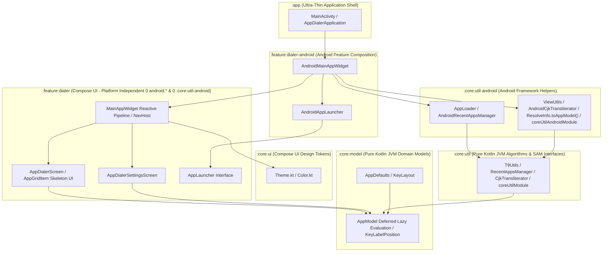

# AppDialer Architecture & Engineering Guidelines

This document serves as the authoritative architectural blueprint for **AppDialer**, outlining multi-module design principles, platform decoupling rules, dependency injection patterns, reactive state management, concurrency control, navigation architecture, and testing standards.

---

## 🏛️ 1. Multi-Module Design Principles & Layering

AppDialer enforces strict single-responsibility modularization across 6 Gradle modules. 
To ensure max maintainability, reusability, and multiplatform readiness (Kotlin Multiplatform / Compose Multiplatform):
- **Domain & Utilities MUST be Pure Kotlin (JVM)**: Free of any Android AGP or Android framework dependencies.
- **UI & Logic MUST be Platform Independent**: Decoupled from platform frameworks via functional interfaces.
- **Android Framework Adapters MUST be Isolated**: Encapsulated in dedicated `-android` composition modules.



### Module Responsibilities Matrix

| Module | Plugin Type | Responsibilities & Boundaries | Multiplatform Ready |
| :--- | :--- | :--- | :---: |
| **`:core:model`** | `id("kotlin")` (JVM) | Pure domain models (`AppModel` with deferred lazy evaluation & `iconProvider`), enums (`KeyLabelPosition`), constants (`AppDefaults`), and keypad configurations (`KeyLayout`). Zero Android SDK/Compose dependencies. | ✅ Yes |
| **`:core:util`** | `id("kotlin")` (JVM) | Pure search algorithms (`T9Utils`), preference contracts (`RecentAppsManager`), in-memory implementations (`InMemoryRecentAppsManager`), Koin DI (`coreUtilModule`), and SAM interfaces (`CjkTransliterator`). Zero Android SDK dependencies. | ✅ Yes |
| **`:core:ui`** | `com.android.library` | Compose UI design tokens (`Color.kt`, `Theme.kt`), atomic UI components, and typography. | 🟢 Compose Multiplatform |
| **`:core:util-android`** | `com.android.library` | Android framework helpers (`AppLoader`, `AndroidRecentAppsManager`, `ResolveInfo.toAppModel()`, `ViewUtils`, `DrawableUtils.toImageBitmap()`, `AndroidCjkTransliterator`, `coreUtilAndroidModule`) using `Context`, `SharedPreferences`, `PackageManager`, and `android.icu`. | ❌ Android Only |
| **`:feature:dialer`** | `com.android.library` | Platform-independent Compose UI screens (`AppDialerScreen`, `AppDialerSettingsScreen`), keypad layouts, reactive search pipeline (`MainAppWidget`), and navigation. Decoupled via `AppLauncher` and `RecentAppsManager` interfaces with **0 `android.*` imports and 0 `:core:util-android` dependency**. | 🟢 Compose Multiplatform |
| **`:feature:dialer-android`** | `com.android.library` | Android feature composition (`AndroidMainAppWidget`, `AndroidAppLauncher`) bridging Android `Context`, `Intent`, `Settings`, `Toast`, `AppLoader`, and `AndroidRecentAppsManager` to `:feature:dialer`. | ❌ Android Only |
| **`:app`** | `com.android.application` | Ultra-thin entrypoint hosting `AppDialerApplication` (Koin initialization), `MainActivity`, `AndroidManifest.xml`, launcher icons, and top-level app composition. | ❌ Android Only |

---

## 🔌 2. Dependency Injection Architecture (Koin DI)

### Koin DI Integration
AppDialer adopts **Koin 3.5.3** as the primary Dependency Injection framework across all modules:
1. **Pure Kotlin Module (`coreUtilModule` in `:core:util`)**:
   Provides zero-android dependencies:
   ```kotlin
   val coreUtilModule = module {
       single<CjkTransliterator> { DefaultCjkTransliterator }
       single<RecentAppsManager> { InMemoryRecentAppsManager() }
   }
   ```
2. **Android Adapter Module (`coreUtilAndroidModule` in `:core:util-android`)**:
   Provides Android-native implementations:
   ```kotlin
   val coreUtilAndroidModule = module {
       single<CjkTransliterator> { AndroidCjkTransliterator }
       single<RecentAppsManager> { AndroidRecentAppsManager(get()) }
   }
   ```
3. **Application Initialization (`AppDialerApplication` in `:app`)**:
   Starts Koin container on application startup:
   ```kotlin
   class AppDialerApplication : Application() {
       override fun onCreate() {
           super.onCreate()
           startKoin {
               androidLogger(Level.ERROR)
               androidContext(this@AppDialerApplication)
               modules(coreUtilAndroidModule)
           }
       }
   }
   ```

---

## 🔄 3. Reactive State & Concurrency Control

1. **Unidirectional Data Flow (UDF) & `StateFlow`**:
   All UI state updates flow through reactive state holders (`StateFlow` / `MutableStateFlow` or Compose `remember` / `derivedStateOf`). Composable screens consume state as read-only value streams.
2. **T9 Input Debouncing (`Flow.debounce`)**:
   Rapid multi-tap T9 keypad typing is debounced (50ms) via `snapshotFlow { searchQuery }.debounce(50L)` to avoid unnecessary search and scoring operations across 200+ installed apps.
3. **Concurrency Protection & Off-Thread Processing (`flatMapLatest` & `Dispatchers.Default`)**:
   In-flight search filtering jobs are automatically cancelled upon receiving new key digits via `flatMapLatest`, with calculations running off the main thread on `Dispatchers.Default`:
   ```kotlin
   LaunchedEffect(allApps, isZhuyinEnabled, isDisablePinyinOnZhuyinEnabledState) {
       snapshotFlow { searchQuery }
           .debounce(50L)
           .flatMapLatest { query ->
               flow {
                   val recentPackages = recentAppsManager.getRecentApps()
                   val isFuzzy = recentAppsManager.isFuzzySearchEnabled()
                   val result = allApps.filterAndScore(
                       query = query,
                       recentPackageNames = recentPackages,
                       isFuzzyEnabled = isFuzzy,
                       isZhuyinEnabled = isZhuyinEnabled,
                       isDisablePinyinOnZhuyin = isDisablePinyinOnZhuyinEnabledState
                   )
                   emit(result)
               }.flowOn(Dispatchers.Default)
           }
           .collect { filtered ->
               filteredApps = filtered
           }
   }
   ```

---

## ⚡ 4. Performance & Async UI Architecture

1. **`ResolveInfo.toAppModel()` Mapping Extension**:
   `ResolveInfo.toAppModel(pm, transliterator)` encapsulates converting Android `ResolveInfo` objects into domain `AppModel` instances with deferred lazy providers for `iconProvider`, `t9CjkFullProvider`, `t9CjkInitialsProvider`, and `t9ZhuyinInitialsProvider`.
2. **Async Icon Loading with Skeleton Placeholder (`AppGridItem`)**:
   When rendering `AppGridItem`, `AppModel.iconProvider` is evaluated asynchronously on background thread (`Dispatchers.IO`). While loading, a sleek 48.dp **Skeleton Loading Placeholder** displaying the app's first initial letter is shown on translucent background (`onSurface.copy(alpha = 0.12f)`). When decoded, the icon updates seamlessly.
3. **Deferred / Lazy Evaluation in `AppModel`**:
   `AppModel` supports lazy providers (`iconProvider`, `t9CjkFullProvider`, `t9CjkInitialsProvider`, `t9ZhuyinInitialsProvider`). Heavy tasks (such as PNG/Canvas icon rendering and ICU CJK transliteration) are deferred until the property is explicitly read during search or UI rendering.
4. **In-Memory Volatile Caching (`AppLoader.cachedApps`)**:
   `AppLoader` maintains an in-memory `@Volatile` cache of loaded `AppModel` lists. Subsequent calls to `loadInstalledApps()` return cached results in **0 milliseconds**.
5. **Early Background Pre-Warming**:
   `MainActivity.onCreate()` launches background cache loading on `Dispatchers.IO` immediately upon Activity instantiation.

---

## 📱 5. Activity & Navigation Architecture

1. **Ultra-Thin Activity Shell**: `MainActivity` is strictly limited to Activity lifecycle events, window transparency (`applyTransparentWindow()`), and passing intent re-launch triggers (`resetSignal`). It NEVER holds UI state or search query buffers.
2. **Encapsulated State Container (`MainAppWidget`)**: All UI state management, search query filtering, and preference synchronization are encapsulated inside `MainAppWidget`.
3. **Jetpack Navigation Compose (`NavHost`)**: Screen routing between `Destinations.DIALER` and `Destinations.SETTINGS` MUST use official Jetpack `NavHost` and `rememberNavController()`.
4. **Fade Overlay Transitions for Dialog UX**: Because AppDialer is a translucent floating overlay app, `NavHost` MUST configure `fadeIn()` and `fadeOut()` transitions (`tween(200)`). Standard side-slide screen transitions MUST NOT be used for dialog overlays.
5. **Platform-Independent Touch Feedback**: Composable touch feedback MUST use Compose's native `LocalHapticFeedback.current.performHapticFeedback()` instead of Android `View.performHapticFeedback()`.

---

## 🧪 6. Testing & Quality Assurance Standards

### 1. Multi-Module Unit Tests
Every module MUST maintain unit tests covering its public APIs and domain contracts (`:core:model`, `:core:util`, `:feature:dialer`). Unit tests MUST run in pure JVM environments without Robolectric or Android emulator overhead.

### 2. UI Component Testing (`ComposeTestRule` in `:feature:dialer`)
UI interactions in `AppDialerScreenTest.kt` use `createComposeRule()` to test T9 keypad tapping, backspace deletion, and filtered app rendering:
```kotlin
@get:Rule
val composeTestRule = createComposeRule()

@Test
fun testKeypadInputAndAppFiltering() {
    composeTestRule.setContent {
        AppDialerTheme {
            MainAppWidget(loadApps = { listOf(sampleApp) })
        }
    }

    composeTestRule.onNodeWithText("2").performClick()
    composeTestRule.onNodeWithText("Camera").assertIsDisplayed()
}
```

### 3. Integration & E2E Testing Strategy (Maestro)
Use **Maestro** or `integration_test` to verify overlay dialog dismiss on outside tap, app launch flow, and translucent background rendering.

### 4. Pre-Commit Build Verification
Run `./gradlew test assembleDebug` across all modules before any commit to ensure clean compilation and 100% test pass rate.
