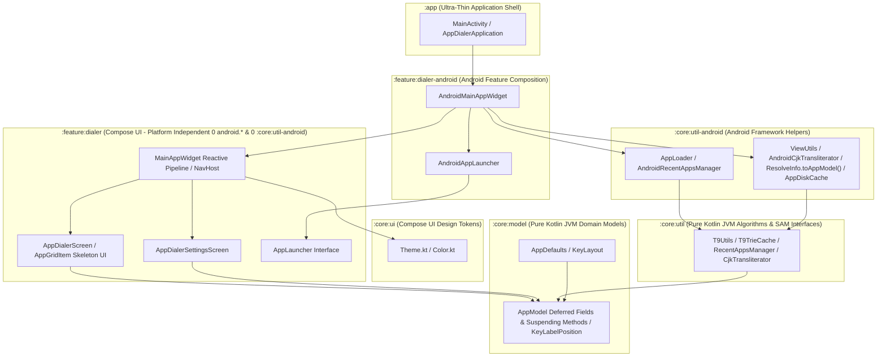

# AppDialer Architecture & Engineering Guidelines

This document serves as the authoritative architectural blueprint for **AppDialer**, outlining multi-module design principles, platform decoupling rules, dependency injection patterns, reactive state management, concurrency control, navigation architecture, and testing standards.

---

## 🏛️ 1. Multi-Module Design Principles & Layering

AppDialer enforces strict single-responsibility modularization across 6 Gradle modules. 
To ensure max maintainability, reusability, and multiplatform readiness (Kotlin Multiplatform / Compose Multiplatform):
- **Domain & Utilities MUST be Pure Kotlin (JVM)**: Free of any Android AGP or Android framework dependencies.
- **UI & Logic MUST be Platform Independent**: Decoupled from platform frameworks via functional interfaces.
- **Android Framework Adapters MUST be Isolated**: Encapsulated in dedicated `-android` composition modules.



### Module Responsibilities Matrix

| Module | Plugin Type | Responsibilities & Boundaries | Multiplatform Ready |
| :--- | :--- | :--- | :---: |
| **`:core:model`** | `id("kotlin")` (JVM) | Pure domain models (`AppModel` with `Deferred<T>` fields & suspending methods), enums (`KeyLabelPosition`), constants (`AppDefaults`), and keypad configurations (`KeyLayout`). Zero Android SDK/Compose dependencies. | ✅ Yes |
| **`:core:util`** | `id("kotlin")` (JVM) | Pure search algorithms (`T9Utils`), T9 prefix trie cache (`T9TrieCache`), preference contracts (`RecentAppsManager`), in-memory implementations (`InMemoryRecentAppsManager`), Koin DI (`coreUtilModule`), and SAM interfaces (`CjkTransliterator`). Zero Android SDK dependencies. | ✅ Yes |
| **`:core:ui`** | `com.android.library` | Compose UI design tokens (`Color.kt`, `Theme.kt`), atomic UI components, and typography. | 🟢 Compose Multiplatform |
| **`:core:util-android`** | `com.android.library` | Android framework helpers (`AppLoader`, `AppDiskCache`, `AndroidRecentAppsManager`, `ResolveInfo.toAppModel()`, `ViewUtils`, `DrawableUtils.toImageBitmap()`, `AndroidCjkTransliterator`, `coreUtilAndroidModule`) using `Context`, `SharedPreferences`, `PackageManager`, and `android.icu`. | ❌ Android Only |
| **`:feature:dialer`** | `com.android.library` | Platform-independent Compose UI screens (`AppDialerScreen`, `AppDialerSettingsScreen`), keypad layouts, reactive search pipeline (`MainAppWidget`), and navigation. Decoupled via `AppLauncher` and `RecentAppsManager` interfaces with **0 `android.*` imports and 0 `:core:util-android` dependency**. | 🟢 Compose Multiplatform |
| **`:feature:dialer-android`** | `com.android.library` | Android feature composition (`AndroidMainAppWidget`, `AndroidAppLauncher`) bridging Android `Context`, `Intent`, `Settings`, `Toast`, `AppLoader`, and `AndroidRecentAppsManager` to `:feature:dialer`. | ❌ Android Only |
| **`:app`** | `com.android.application` | Ultra-thin entrypoint hosting `AppDialerApplication` (Koin initialization), `MainActivity`, `AndroidManifest.xml`, launcher icons, and top-level app composition. | ❌ Android Only |

---

## ⚡ 4. Performance & Async UI Architecture

1. **T9 Prefix Trie Cache (`T9TrieCache`)**:
   - T9 search queries use `T9TrieCache` for $O(K)$ lookup speed (~0.01ms).
   - `preWarmRecentQueries(allApps, recentQueries)` runs in a background coroutine upon app startup to pre-build Trie nodes for recent search inputs.
2. **AppModel Non-Bitmap Metadata Disk Cache (`AppDiskCache`)**:
   - `AppDiskCache` persists `AppModel` text & T9/CJK search indices to JSON SharedPreferences on disk.
   - On cold start, `AppLoader` reads cached metadata from disk in **< 2ms**, providing instant app availability while `PackageManager` scans for package updates in background.
3. **`Deferred<T>` & Suspending Methods in `AppModel`**:
   - `AppModel` supports `Deferred<T>` fields (`iconDeferred`, `t9CjkFullDeferred`, `t9CjkInitialsDeferred`, `t9ZhuyinInitialsDeferred`) and suspending fetchers (`awaitIcon()`, `awaitCjkFull()`, `awaitCjkInitials()`, `awaitZhuyinInitials()`).
   - Heavy tasks (Canvas bitmap rendering and ICU CJK transliteration) run asynchronously in background jobs, preventing any main-thread blocking.
4. **In-Memory Volatile Caching (`AppLoader.cachedApps`)**:
   - `AppLoader` maintains an in-memory `@Volatile` cache. Re-open calls return cached results in **0 milliseconds**.

---

## 🔌 2. Dependency Injection Architecture (Koin DI)

### Koin DI Integration
AppDialer adopts **Koin 3.5.3** as the primary Dependency Injection framework across all modules:
1. **Pure Kotlin Module (`coreUtilModule` in `:core:util`)**:
   ```kotlin
   val coreUtilModule = module {
       single<CjkTransliterator> { DefaultCjkTransliterator }
       single<RecentAppsManager> { InMemoryRecentAppsManager() }
   }
   ```
2. **Android Adapter Module (`coreUtilAndroidModule` in `:core:util-android`)**:
   ```kotlin
   val coreUtilAndroidModule = module {
       single<CjkTransliterator> { AndroidCjkTransliterator }
       single<RecentAppsManager> { AndroidRecentAppsManager(get()) }
   }
   ```
3. **Application Initialization (`AppDialerApplication` in `:app`)**:
   ```kotlin
   class AppDialerApplication : Application() {
       override fun onCreate() {
           super.onCreate()
           startKoin {
               androidLogger(Level.ERROR)
               androidContext(this@AppDialerApplication)
               modules(coreUtilAndroidModule)
           }
       }
   }
   ```

---

## 🔄 3. Reactive State & Concurrency Control

1. **Unidirectional Data Flow (UDF) & `StateFlow`**:
   All UI state updates flow through reactive state holders (`StateFlow` / `MutableStateFlow` or Compose `remember` / `derivedStateOf`).
2. **T9 Input Debouncing (`Flow.debounce`)**:
   Rapid multi-tap T9 keypad typing is debounced (50ms) via `snapshotFlow { searchQuery }.debounce(50L)`.
3. **Concurrency Protection & Off-Thread Processing (`flatMapLatest` & `Dispatchers.Default`)**:
   In-flight search filtering jobs are automatically cancelled upon receiving new key digits via `flatMapLatest`.

---

## 📱 5. Activity & Navigation Architecture

1. **Ultra-Thin Activity Shell**: `MainActivity` is strictly limited to Activity lifecycle events and window transparency (`applyTransparentWindow()`).
2. **Encapsulated State Container (`MainAppWidget`)**: All UI state management, search query filtering, and preference synchronization are encapsulated inside `MainAppWidget`.
3. **Jetpack Navigation Compose (`NavHost`)**: Screen routing between `Destinations.DIALER` and `Destinations.SETTINGS` uses `NavHost`.
4. **Fade Overlay Transitions for Dialog UX**: `NavHost` configures `fadeIn()` and `fadeOut()` transitions (`tween(200)`).

---

## 🧪 6. Testing & Quality Assurance Standards

### 1. Multi-Module Unit Tests
Every module maintains unit tests covering its public APIs and domain contracts (`:core:model`, `:core:util`, `:feature:dialer`).

### 2. UI Component Testing (`ComposeTestRule` in `:feature:dialer`)
UI interactions in `AppDialerScreenTest.kt` use `createComposeRule()` to test T9 keypad tapping, backspace deletion, and filtered app rendering.

### 3. Pre-Commit Build Verification
Run `./gradlew test assembleDebug` across all modules before any commit to ensure clean compilation and 100% test pass rate.
