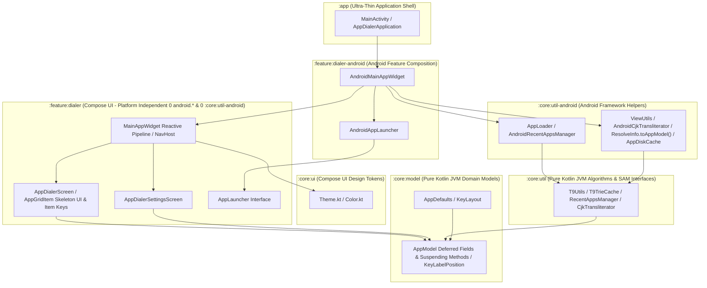

# AppDialer Architecture & Engineering Guidelines

This document serves as the authoritative architectural blueprint for **AppDialer**, outlining multi-module design principles, platform decoupling rules, dependency injection patterns, reactive state management, concurrency control, navigation architecture, performance optimization caches, and testing standards.

---

## 🏛️ 1. Multi-Module Design Principles & Layering

AppDialer enforces strict single-responsibility modularization across 6 Gradle modules. 
To ensure max maintainability, reusability, and multiplatform readiness (Kotlin Multiplatform / Compose Multiplatform):
- **Domain & Utilities MUST be Pure Kotlin (JVM)**: Free of any Android AGP or Android framework dependencies.
- **UI & Logic MUST be Platform Independent**: Decoupled from platform frameworks via functional interfaces.
- **Android Framework Adapters MUST be Isolated**: Encapsulated in dedicated `-android` composition modules.



### Module Responsibilities Matrix

| Module | Plugin Type | Responsibilities & Boundaries | Multiplatform Ready |
| :--- | :--- | :--- | :---: |
| **`:core:model`** | `id("kotlin")` (JVM) | Pure domain models (`AppModel` with `Deferred<T>` fields & suspending methods), enums (`KeyLabelPosition`), constants (`AppDefaults`), and keypad configurations (`KeyLayout`). Zero Android SDK/Compose dependencies. | ✅ Yes |
| **`:core:util`** | `id("kotlin")` (JVM) | Pure search algorithms (`T9Utils`), T9 prefix trie cache (`T9TrieCache`), preference contracts (`RecentAppsManager`), in-memory implementations (`InMemoryRecentAppsManager`), Koin DI (`coreUtilModule`), and SAM interfaces (`CjkTransliterator`). Zero Android SDK dependencies. | ✅ Yes |
| **`:core:ui`** | `com.android.library` | Compose UI design tokens (`Color.kt`, `Theme.kt`), atomic UI components, and typography. | 🟢 Compose Multiplatform |
| **`:core:util-android`** | `com.android.library` | Android framework helpers (`AppLoader`, `AppDiskCache`, `AndroidRecentAppsManager`, `ResolveInfo.toAppModel()`, `ViewUtils`, `DrawableUtils.toImageBitmap()`, `AndroidCjkTransliterator`, `coreUtilAndroidModule`) using `Context`, `SharedPreferences`, `PackageManager`, and `android.icu`. | ❌ Android Only |
| **`:feature:dialer`** | `com.android.library` | Platform-independent Compose UI screens (`AppDialerScreen`, `AppDialerSettingsScreen`), keypad layouts, reactive search pipeline (`MainAppWidget`), item key optimizations, and navigation. Decoupled via `AppLauncher` and `RecentAppsManager` interfaces with **0 `android.*` imports and 0 `:core:util-android` dependency**. | 🟢 Compose Multiplatform |
| **`:feature:dialer-android`** | `com.android.library` | Android feature composition (`AndroidMainAppWidget`, `AndroidAppLauncher`) bridging Android `Context`, `Intent`, `Settings`, `Toast`, `AppLoader`, and `AndroidRecentAppsManager` to `:feature:dialer`. | ❌ Android Only |
| **`:app`** | `com.android.application` | Ultra-thin entrypoint hosting `AppDialerApplication` (Koin initialization), `MainActivity`, `AndroidManifest.xml`, launcher icons, and top-level app composition. | ❌ Android Only |

---

## ⚡ 2. Performance, Trie Cache & Instant Launch Architecture

### ⚡ 2.1 0ms Instant Cold-Start & Non-Blocking Background Scanning
To eliminate visual delays when opening AppDialer:

1. **Immediate Disk Cache Return ([`AppLoader.kt`](file:///Users/yongjhih/AndroidStudioProjects/AppDialer/core/util-android/src/main/java/com/github/yongjhih/appdialer/util/AppLoader.kt))**:
   `AppLoader.loadInstalledApps(context)` reads `AppDiskCache` in **< 2ms** and returns `diskApps` immediately without waiting for `PackageManager.queryIntentActivities` (which takes ~300-500ms).
2. **Asynchronous Background Sync**:
   `PackageManager.queryIntentActivities` is dispatched asynchronously in a background coroutine (`scope.launch { scanPackageManager(...) }`) to update memory and disk caches without delaying app UI rendering.
3. **0ms Initial State Pipeline Emission ([`MainAppWidget.kt`](file:///Users/yongjhih/AndroidStudioProjects/AppDialer/feature/dialer/src/main/java/com/github/yongjhih/appdialer/ui/MainAppWidget.kt))**:
   `MainAppWidget` immediately evaluates and renders initial recent apps with 0ms delay. T9 typing debounce (`50ms`) is applied dynamically via `.debounce { query -> if (query.isEmpty()) 0L else 50L }` only when the user types digits.

---

### 🚀 2.2 LazyRow Item Keys & State Preservation for Silky Smooth UI
To achieve buttery smooth scrolling and zero icon reloading/flickering during rapid T9 keypad typing:

1. **`LazyRow` Explicit Unique Item Keys**:
   `LazyRow` uses explicit item keys (`key = { app -> "${app.packageName}/${app.className}" }`), allowing Compose to track, reuse, and reorder item composables without re-instantiating them.
2. **Stable State Preservation (`remember` & `LaunchedEffect`)**:
   `AppGridItem` keys internal bitmap state on `app.packageName` and `app.className` instead of the full `AppModel` object (`remember(app.packageName, app.className)`). When T9 typing re-scores `AppModel` instances with updated `matchScore` and `matchedIndices`, the already-decoded `imageBitmap` is preserved in memory **100% flicker-free**.

---

### 🌲 2.3 T9 Prefix Trie Cache (`T9TrieCache`) & Background Pre-Warming
To achieve microsecond-level ($O(K)$) response times when the user taps digits on the T9 keypad, AppDialer utilizes `T9TrieCache` in `:core:util`:

1. **Tree Architecture**:
   Each node (`TrieNode`) maps digit characters (`'2'..'9'`) to child nodes and maintains a list of matching `AppModel` references.
2. **Time Complexity**:
   Searching for a T9 digit sequence (e.g., `"236"`) traverses at most $K$ nodes ($K$ = query length, typically 1 to 5 digits), yielding sub-millisecond (~0.01ms) instant filtering regardless of installed app count.
3. **Background Pre-Warming Pipeline**:
   Upon app startup, `T9TrieCache.preWarmRecentQueries(allApps, recentQueries)` runs on `Dispatchers.Default` to populate nodes for recent and frequent search queries.

---

### 🖼️ 2.4 Async Icon Loading (`awaitIcon()`) & Skeleton Placeholder UI
Decoding Android `Drawable`s into Compose `ImageBitmap`s involves IPC and Canvas bitmap creation, which causes main-thread jank if performed synchronously during composition.

1. **Deferred / Suspending Asset Contract (`AppModel`)**:
   `AppModel` encapsulates lazy providers (`iconProvider: (() -> Any?)?`, `iconDeferred: Deferred<Any?>?`) and exposes a non-blocking suspending fetcher `awaitIcon()`.
2. **Off-Thread Composition in `AppGridItem` (`:feature:dialer`)**:
   `AppGridItem` executes `app.awaitIcon()` inside `LaunchedEffect(app.packageName, app.className)` on `Dispatchers.IO`.
3. **Skeleton Loading Placeholder**:
   While `imageBitmap` is null (loading in background), `AppGridItem` renders a 48.dp rounded square skeleton box with a soft translucent background (`onSurface.copy(alpha = 0.12f)`) displaying the app's first initial letter. Upon resolution, `imageBitmap` updates smoothly.
4. **Dynamic Icon Providers for Disk-Cached Models (`AppDiskCache`)**:
   When `AppDiskCache` restores `AppModel` instances from disk on cold start, it dynamically attaches `iconProvider = { pm.getApplicationIcon(packageName).toImageBitmap() }`. When rendered, `awaitIcon()` evaluates this provider off-thread, guaranteeing icons render seamlessly for both disk-cached and fresh models.

---

## 🔌 3. Dependency Injection Architecture (Koin DI)

### Koin DI Integration
AppDialer adopts **Koin 3.5.3** as the primary Dependency Injection framework across all modules:
1. **Pure Kotlin Module (`coreUtilModule` in `:core:util`)**:
   ```kotlin
   val coreUtilModule = module {
       single<CjkTransliterator> { DefaultCjkTransliterator }
       single<RecentAppsManager> { InMemoryRecentAppsManager() }
   }
   ```
2. **Android Adapter Module (`coreUtilAndroidModule` in `:core:util-android`)**:
   ```kotlin
   val coreUtilAndroidModule = module {
       single<CjkTransliterator> { AndroidCjkTransliterator }
       single<RecentAppsManager> { AndroidRecentAppsManager(get()) }
   }
   ```
3. **Application Initialization (`AppDialerApplication` in `:app`)**:
   ```kotlin
   class AppDialerApplication : Application() {
       override fun onCreate() {
           super.onCreate()
           startKoin {
               androidLogger(Level.ERROR)
               androidContext(this@AppDialerApplication)
               modules(coreUtilAndroidModule)
           }
       }
   }
   ```

---

## 🔄 4. Reactive State & Concurrency Control

1. **Unidirectional Data Flow (UDF) & `StateFlow`**:
   All UI state updates flow through reactive state holders (`StateFlow` / `MutableStateFlow` or Compose `remember` / `derivedStateOf`).
2. **T9 Input Debouncing (`Flow.debounce`)**:
   Rapid multi-tap T9 keypad typing is debounced (50ms) via `snapshotFlow { searchQuery }.debounce { query -> if (query.isEmpty()) 0L else 50L }`.
3. **Concurrency Protection & Off-Thread Processing (`flatMapLatest` & `Dispatchers.Default`)**:
   In-flight search filtering jobs are automatically cancelled upon receiving new key digits via `flatMapLatest`.

---

## 📱 5. Activity & Navigation Architecture

1. **Ultra-Thin Activity Shell**: `MainActivity` is strictly limited to Activity lifecycle events and window transparency (`applyTransparentWindow()`).
2. **Encapsulated State Container (`MainAppWidget`)**: All UI state management, search query filtering, and preference synchronization are encapsulated inside `MainAppWidget`.
3. **Jetpack Navigation Compose (`NavHost`)**: Screen routing between `Destinations.DIALER` and `Destinations.SETTINGS` uses `NavHost`.
4. **Fade Overlay Transitions for Dialog UX**: `NavHost` configures `fadeIn()` and `fadeOut()` transitions (`tween(200)`).

---

## 🧪 6. Testing & Quality Assurance Standards

### 1. Multi-Module Unit Tests
Every module maintains unit tests covering its public APIs and domain contracts (`:core:model`, `:core:util`, `:feature:dialer`).

### 2. UI Component Testing (`ComposeTestRule` in `:feature:dialer`)
UI interactions in `AppDialerScreenTest.kt` use `createComposeRule()` to test T9 keypad tapping, backspace deletion, and filtered app rendering.

### 3. Pre-Commit Build Verification
Run `./gradlew test assembleDebug` across all modules before any commit to ensure clean compilation and 100% test pass rate.
