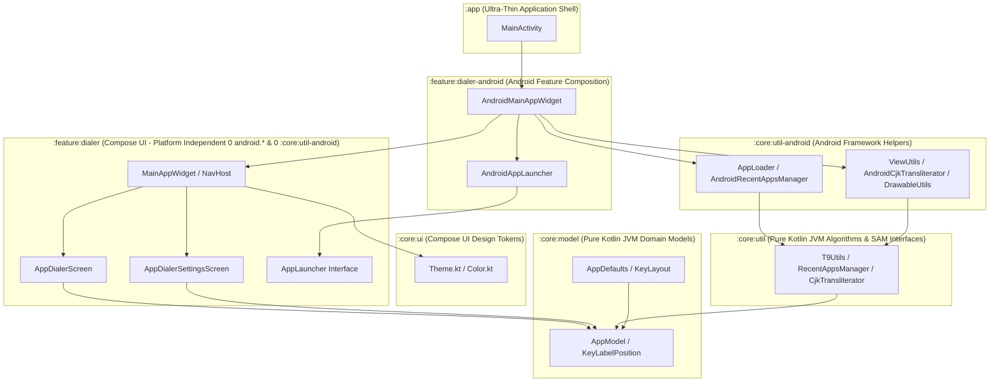

# AppDialer Architecture & Engineering Guidelines

This document serves as the authoritative architectural blueprint for **AppDialer**, outlining multi-module design principles, platform decoupling rules, dependency injection patterns, navigation architecture, and testing standards.

---

## 🏛️ 1. Multi-Module Design Principles & Layering

AppDialer enforces strict single-responsibility modularization across 6 Gradle modules. 
To ensure max maintainability, reusability, and multiplatform readiness (Kotlin Multiplatform / Compose Multiplatform):
- **Domain & Utilities MUST be Pure Kotlin (JVM)**: Free of any Android AGP or Android framework dependencies.
- **UI & Logic MUST be Platform Independent**: Decoupled from platform frameworks via functional interfaces.
- **Android Framework Adapters MUST be Isolated**: Encapsulated in dedicated `-android` composition modules.



### Module Responsibilities Matrix

| Module | Plugin Type | Responsibilities & Boundaries | Multiplatform Ready |
| :--- | :--- | :--- | :---: |
| **`:core:model`** | `id("kotlin")` (JVM) | Pure domain models (`AppModel`), enums (`KeyLabelPosition`), constants (`AppDefaults`), and keypad configurations (`KeyLayout`). Zero Android SDK/Compose dependencies. | ✅ Yes |
| **`:core:util`** | `id("kotlin")` (JVM) | Pure search algorithms (`T9Utils`), preference contracts (`RecentAppsManager`), in-memory implementations (`InMemoryRecentAppsManager`), and SAM interfaces (`CjkTransliterator`). Zero Android SDK dependencies. | ✅ Yes |
| **`:core:ui`** | `com.android.library` | Compose UI design tokens (`Color.kt`, `Theme.kt`), atomic UI components, and typography. | 🟢 Compose Multiplatform |
| **`:core:util-android`** | `com.android.library` | Android framework helpers (`AppLoader`, `AndroidRecentAppsManager`, `ViewUtils`, `DrawableUtils`, `AndroidCjkTransliterator`) using `Context`, `SharedPreferences`, `PackageManager`, and `android.icu`. | ❌ Android Only |
| **`:feature:dialer`** | `com.android.library` | Platform-independent Compose UI screens (`AppDialerScreen`, `AppDialerSettingsScreen`), keypad layouts, and navigation (`MainAppWidget`). Decoupled via `AppLauncher` and `RecentAppsManager` interfaces with **0 `android.*` imports and 0 `:core:util-android` dependency**. | 🟢 Compose Multiplatform |
| **`:feature:dialer-android`** | `com.android.library` | Android feature composition (`AndroidMainAppWidget`, `AndroidAppLauncher`) bridging Android `Context`, `Intent`, `Settings`, `Toast`, `AppLoader`, and `AndroidRecentAppsManager` to `:feature:dialer`. | ❌ Android Only |
| **`:app`** | `com.android.application` | Ultra-thin entrypoint hosting `MainActivity`, `AndroidManifest.xml`, launcher icons, and top-level app composition. | ❌ Android Only |

---

## 🔌 2. Dependency Injection & Decoupling Principles

### ❌ Anti-Patterns Avoided
1. **No Reflection for Framework APIs**: Avoid using reflection (`Class.forName()`) to access platform features. Instead, extract a clean SAM interface in the core module and provide native implementations in platform modules.
2. **No Global Singletons or Static Mutable State**: Avoid Service Locators or companion object mutable instances (`var currentInstance`). Static state introduces thread race conditions, hidden dependencies, and testing side-effects.

### ✅ Best Practices Enforced
1. **Interface Contract & Parameter Injection**:
   Isolate storage, framework dependencies, and preferences behind pure interfaces (`RecentAppsManager`, `AppLauncher`, `CjkTransliterator`).
   ```kotlin
   // In :core:util - Pure Interface Contract
   interface RecentAppsManager {
       fun addRecentApp(packageName: String)
       fun getRecentApps(): List<String>
       ...
   }

   // In :feature:dialer - Pure Compose UI Dependency (No :core:util-android dependency!)
   @Composable
   fun MainAppWidget(
       recentAppsManager: RecentAppsManager = InMemoryRecentAppsManager(),
       appLauncher: AppLauncher? = null,
       ...
   )

   // In :feature:dialer-android - Android SharedPreferences Adapter
   val manager = remember(context) { AndroidRecentAppsManager(context) }
   ```
2. **Functional Parameter Injection with Default Arguments**:
   Pass dependencies explicitly as function or constructor parameters with sensible default values (`DefaultCjkTransliterator`, `InMemoryRecentAppsManager`).
3. **Pre-converted UI Assets for Platform Independence**:
   Convert platform-specific graphics assets (e.g. Android `Drawable`) to platform-independent UI types (Compose `ImageBitmap`) at the data layer (`AppLoader` in `:core:util-android`). This eliminates platform graphic utility dependencies from feature UI modules.

---

## 📱 3. Activity & Navigation Architecture

1. **Ultra-Thin Activity Shell**: `MainActivity` is strictly limited to Activity lifecycle events, window transparency (`applyTransparentWindow()`), and passing intent re-launch triggers (`resetSignal`). It NEVER holds UI state or search query buffers.
2. **Encapsulated State Container (`MainAppWidget`)**: All UI state management, search query filtering, and preference synchronization are encapsulated inside `MainAppWidget`.
3. **Jetpack Navigation Compose (`NavHost`)**: Screen routing between `Destinations.DIALER` and `Destinations.SETTINGS` MUST use official Jetpack `NavHost` and `rememberNavController()`.
4. **Platform-Independent Touch Feedback**: Composable touch feedback MUST use Compose's native `LocalHapticFeedback.current.performHapticFeedback()` instead of Android `View.performHapticFeedback()`.

---

## 🧪 4. Testing & Quality Assurance Standards

- **Multi-Module Unit Tests**: Every module MUST maintain unit tests covering its public APIs and domain contracts (`:core:model`, `:core:util`, `:feature:dialer`).
- **Pre-Commit Build Verification**: Run `./gradlew test assembleDebug` across all modules before any commit to ensure clean compilation and 100% test pass rate.
- **Clean History Policy**: Git commit history MUST remain 100% free of build outputs (`build/`), temporary swap files (`*.swp`), or IDE artifacts.
