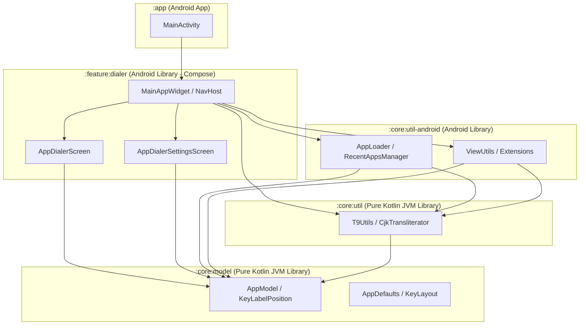

# AppDialer Architecture & Engineering Guidelines

This document outlines the architectural principles, module boundaries, navigation patterns, and Kotlin code style guidelines for **AppDialer**.

---

## 🏛️ 1. Multi-Module Architecture Overview

AppDialer is modularized into single-responsibility Gradle modules separated by layer and framework dependencies.
Both **`:core:model`** and **`:core:util`** are **Pure Kotlin (JVM)** modules, allowing non-Android Kotlin projects (CLI tools, Server backends, KMP, Desktop apps) to depend on them seamlessly.



### Module Responsibilities

| Module | Type | Responsibilities | Non-Android Reusable |
| :--- | :--- | :--- | :---: |
| **`:core:model`** | **Pure Kotlin (JVM)** | Pure domain models (`AppModel`), enums (`KeyLabelPosition`), constants (`AppDefaults`), and keypad value definitions (`KeyLayout`). Zero Android SDK/Compose dependencies (`id("kotlin")`). | ✅ Yes |
| **`:core:util`** | **Pure Kotlin (JVM)** | Pure Kotlin utilities & search algorithms (`T9Utils`, `CjkTransliterator`). Fully decoupled from Android framework APIs (`id("kotlin")`). | ✅ Yes |
| **`:core:util-android`** | Android Library | Android-dependent utility helpers (`AppLoader`, `RecentAppsManager`, `ViewUtils`) requiring `Context`, `SharedPreferences`, `View`, and `PackageManager`. | ❌ Android Only |
| **`:feature:dialer`** | Android Library (Compose) | All Jetpack Compose UI screens, 3x3 interactive keypad diagrams, Material 3 themes (`Theme.kt`, `Color.kt`), and navigation orchestration (`MainAppWidget`). | ❌ Android Only |
| **`:app`** | Android Application | Ultra-thin entrypoint containing `MainActivity`, `AndroidManifest.xml`, launcher icons, and top-level app configuration. | ❌ Android Only |

---

## 📱 2. Ultra-Thin Activity & Declarative Navigation

### Principles
1. **Ultra-Thin Activity Shell**: `MainActivity` is restricted strictly to Android Activity lifecycle initialization, translucent window setup (`applyTransparentWindow()`), and passing re-launch signals (`resetSignal`). It MUST NOT store search queries, app lists, or keypad layout states.
2. **Smart State Container (`MainAppWidget`)**: All UI states, asynchronous app loading, preferences synchronization, and screen routing are encapsulated inside `MainAppWidget`.
3. **Jetpack Navigation Compose (`NavHost`)**: Screen navigation between `Destinations.DIALER` and `Destinations.SETTINGS` MUST use official `NavHost` and `rememberNavController()`.
   - Automatic Backstack: NavHost manages backstack popping automatically on system back gestures or buttons.
   - Re-launch Reset: Re-launching from Home Screen triggers `navController.navigate(Destinations.DIALER) { popUpTo(Destinations.DIALER) { inclusive = true } }`.

---

## 🪄 3. Kotlin KTX & Expressive Extension Guidelines

### View Hierarchy Extensions
Prefer Kotlin `Sequence` KTX extensions over imperative nested loops.
Example (`ViewUtils.kt`):

```kotlin
/**
 * Returns a [Sequence] containing this [View] and its direct children (if it is a [ViewGroup]).
 */
val View.selfAndChildren: Sequence<View>
    get() = sequence {
        yield(this@selfAndChildren)
        (this@selfAndChildren as? ViewGroup)?.children?.let { yieldAll(it) }
    }
```

---

## ⚙️ 4. Build & Testing Standards

- **Unit Testing**: Core search algorithms in `:core:util` (e.g. `T9UtilsTest`) MUST pass with 100% success before committing.
- **Verification**: Build verification MUST be executed via `./gradlew test assembleDebug` across all modules.
