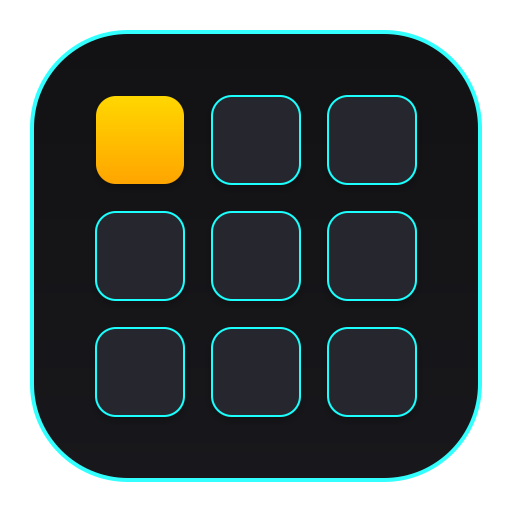
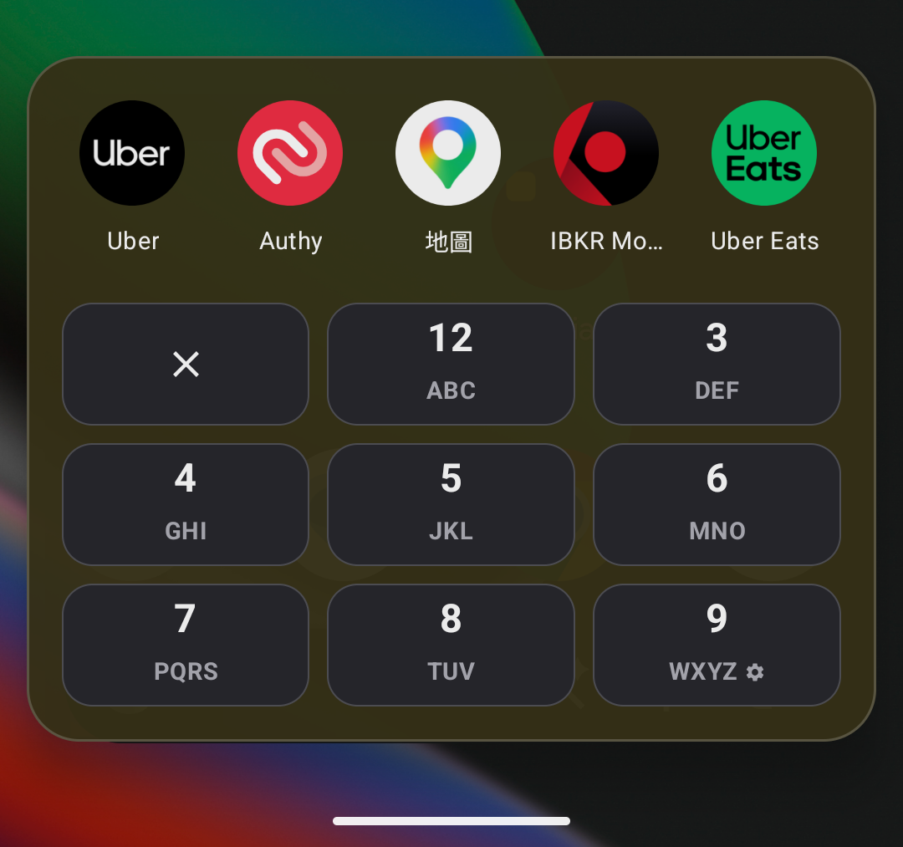

# 📱 AppDialer (繁體中文)

<p align="center">
  
</p>

<p align="center">
  <b>極簡、迅捷的 Android CJK T9 數字鍵盤應用程式啟動器</b>
  <br />
  <i>重溫傳統 T9 撥號體驗 ‧ 支援中文拼音 / 注音與日文羅馬字音譯搜尋 ‧ Jetpack Compose 黑金奢華設計</i>
</p>

<p align="center">
  <a href="README.md"><b>🇬🇧 English</b></a> | <a href="README_zh.md"><b>🇹🇼 繁體中文</b></a>
</p>

<p align="center">
  <a href="https://jitpack.io/#yongjhih/app-dialer-app"></a>
  <a href="https://developer.android.com/about/versions/android-5.0"></a>
  <a href="https://kotlinlang.org/"></a>
  <a href="https://developer.android.com/jetpack/compose"></a>
  <a href="LICENSE"></a>
</p>

---

## 🌟 簡介

**AppDialer** 是一款專為 Android 設計的極速 **T9 數字鍵盤應用程式啟動器**。借鑑經典實體手機 T9 撥號盤的直覺體驗，結合現代化的 **Material 3 黑金**設計語言與原生 **CJK 漢語拼音 / ㄅㄆㄇ注音 / 羅馬字音譯比對引擎**，讓您無需切換輸入法，只需敲擊幾下數字鍵，即可在毫秒間搜尋並開啟任何應用程式！

<p align="center">
  
</p>

---

## ✨ 核心特色

### ⚡ 1. T9 數字鍵盤極速搜尋
- 標準 3x3 撥號盤佈局 (`2: ABC` ~ `9: WXYZ`)，單手操作無壓力。
- 專屬 **清除 `X` 按鈕**（左上角第一顆鍵）：短按退格刪除 1 個字元，長按一鍵清空所有輸入。
- 輕量高效，隨叫隨到，懸浮於桌面之上。

### 🌏 2. 多語言 CJK 音譯與注音搜尋
基於 Android 原生 **ICU Transliterator** 引擎，不增加 APK 體積：
- **注音符號（ㄅㄆㄇㄈ）**：可於設定中開啟「注音搜尋」（預設關閉）。開啟後按鍵會標示注音符號，例如 `2: ABC ㄅㄆㄇㄈ`、`3: DEF ㄉㄊㄋㄌ`。
  - 輸入 `33` ➔ 匹配 **「地圖」** (ㄉㄊ `33`)
  - 輸入 `55` ➔ 匹配 **「相機」** (ㄒㄐ `55`)
- **漢語拼音**：預設模式，支援漢語拼音首字母與全拼比對。
  - 輸入 `38` ➔ 匹配 **「地圖」** (Di Tu `38`)
  - 輸入 `95` ➔ 匹配 **「相機」** (Xiang Ji `95`)
- **日文（平假名 / 片假名）**：支援羅馬字比對。
  - 輸入 `56` ➔ 匹配 **「カメラ」** (Kamera `56`)
  - 輸入 `78` ➔ 匹配 **「設定」** (Settei `78`)
- **英文與數字**：傳統 T9 字母組合全解析與直接匹配。

### 🎨 3. 視覺化互動按鍵佈局選擇器
自由配置按鍵上各大元素的擺放位置：
- **視覺化按鍵預覽卡片**：直接點擊設定頁面預覽卡片上的 5 個位置槽（`左上`、`右上`、`中央`、`左下`、`右下`）進行內容配置。
- **5 大可配置內容**：可選擇置入 `ABC 字母`、`12 數字`、`ㄅㄆㄇ 注音`、`⚙ 設定圖示` 或 `無 (清空)`。
- **智慧尺寸適應**：位於中央的元素自動放大為主要視覺字體，位於四角的元素自動縮小為精緻角標。

### 🎯 4. 智慧模糊比對與高亮提示
- 支援非連續字元比對與前綴加權評分演算法。
- 在應用程式搜尋結果中**精準高亮顯示命中的字元**。

### 🚀 5. 近期應用程式智慧排序
- 自動記錄開啟頻率與近期使用記錄，常用應用程式優先顯示。

### 🎨 6. 黑金視覺設計
- 純粹曜石黑 (`#121214`) 搭配琥珀金 (`#FFD700`) 高亮與微立體鍵盤卡片。
- 撥號盤懸浮透明視窗與獨立實體色設定頁面，展現高質感現代美學。

---

## 🛠️ 技術棧與架構

- **語言**：100% Kotlin
- **使用者介面框架**：Jetpack Compose 與 Material 3
- **音譯引擎**：`android.icu.text.Transliterator`（Android API 29 以上原生框架支援）
- **相容性**：Android API 21 以上（Android 5.0 至 Android 16）
- **非同步與狀態管理**：Kotlin Coroutines、StateFlow、Compose `mutableStateOf`
- **資料儲存**：SharedPreferences（`RecentAppsManager`）

---

## 🚀 開始使用

### 前置需求
- Android Studio Ladybug (或更新版本)
- JDK 17+
- Android SDK 34+

### 編譯與安裝

1. **複製專案庫**：
   ```bash
   git clone https://github.com/yongjhih/app-dialer-app.git
   cd app-dialer-app
   ```

2. **編譯偵錯版 APK**：
   ```bash
   ./gradlew assembleDebug
   ```

3. **執行單元測試**:
   ```bash
   ./gradlew test
   ```

4. **安裝至已連接的 Android 裝置或模擬器**：
   ```bash
   ./gradlew installDebug
   ```

---

## 📦 引入依賴 (JitPack)

在專案根目錄的 `settings.gradle.kts` 新增 JitPack Maven 儲存庫：

```kotlin
dependencyResolutionManagement {
    repositories {
        google()
        mavenCentral()
        maven { url = uri("https://jitpack.io") }
    }
}
```

接著在模組的 `build.gradle.kts` 加入所需的 AppDialer 模組：

```kotlin
dependencies {
    // 純 Kotlin JVM 模型與 T9 搜尋演算法
    implementation("com.github.yongjhih.appdialer:core-model:main-SNAPSHOT")
    implementation("com.github.yongjhih.appdialer:core-util:main-SNAPSHOT")

    // Compose UI 與 Android 功能模組
    implementation("com.github.yongjhih.appdialer:feature-dialer:main-SNAPSHOT")
    implementation("com.github.yongjhih.appdialer:feature-dialer-android:main-SNAPSHOT")
}
```

---

## ⚙️ 設定說明

進入 AppDialer 設定頁面（預設長按 `9` 號鍵）可進行以下設定：

| 設定項目 | 說明 |
| :--- | :--- |
| **視覺化按鍵佈局選擇器** | 點選卡片圖解，設定字母、數字、注音與設定圖示的呈現位置 |
| **長按設定鍵** | 自訂長按開啟設定選單的撥號鍵（`X`、`2` 至 `9`） |
| **注音搜尋** | 開啟 ㄅㄆㄇ 注音 T9 搜尋與鍵盤符號標示（預設關閉） |
| **模糊搜尋** | 允許字元間隔比對（預設開啟） |
| **觸覺回饋** | 撥號鍵盤敲擊震動回饋 |
| **背景變暗程度** | 撥號盤開啟時的背景遮罩深度 |
| **啟動後關閉撥號盤** | 點擊啟動應用程式後自動關閉撥號盤 |

---

## 📄 授權條款

本專案採用 **MIT 授權條款**，詳情請參閱 [LICENSE](LICENSE) 檔案。

```
Copyright (c) 2026 Yongjhih Chen

Permission is hereby granted, free of charge, to any person obtaining a copy
of this software and associated documentation files (the "Software"), to deal
in the Software without restriction, including without limitation the rights
to use, copy, modify, merge, publish, distribute, sublicense, and/or sell
copies of the Software...
```
